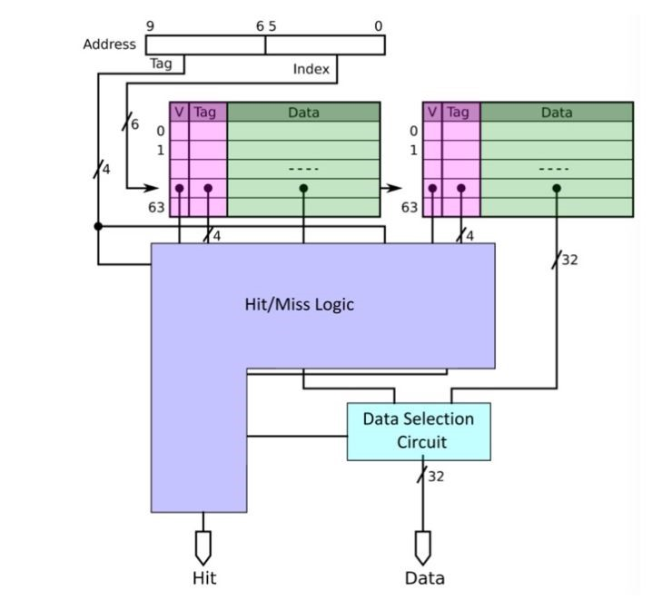

[SAYEH Cache](https://github.com/aminrashidbeigi/SAYEH-Cache.git)
=
This project is an extension to [SAYEH](https://github.com/aminrashidbeigi/SAYEH.git) Basic Computer
which makes it capable of caching data in a separated module between the
Memory and the Processor.

Overveiw
-

  

